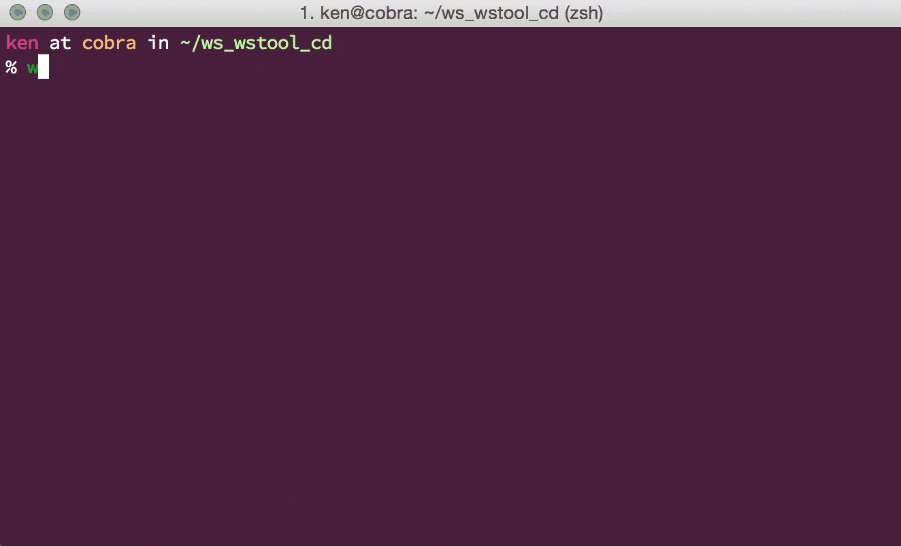

# `wstool_cd`

[](https://pypi.python.org/pypi/wstool_cd)

`cd` to repositories in workspace which is managed by
[vcstools/wstool](https://github.com/vcstools/wstool).

## Installation

install via pypi:

```bash
pip install wstool_cd
```

add following to your .bashrc or `.zshrc`:

```bash
source `which wstool_cd.sh`
```

## Usage

maybe this alias is good:

```bash
alias wlcd='wstool_cd'
```

in workspace which is managed by wstool:

```bash
wstool_cd  # cd to workspace's root
wstool_cd repo0  # cd to a repo0
```

you can set `WSTOOL_DEFAULT_WORKSPACE` to cd from anywhere:

```bash
$ export WSTOOL_DEFAULT_WORKSPACE=$HOME/ros/indigo/src
$ pwd  # not in workspace
/home/wkentaro
$ wstool_cd ros_comm && pwd # if actually not in workspace, cd to default workspace
/home/wkentaro/ros/indigo/src/ros_comm
```

Advanced
--------

this is sometimes dangerous, but useful:

```bash
source `which wstool_cd_wrapper.sh`
wstool cd repo0  # use cd as sub-command of wstool
```

this works because:

```bash
wstool () {
  case "$1" in
    (cd) shift
      wstool_cd $@ ;;
    (*) command wstool $@ ;;
  esac
}
```

Screencast
----------

This is demo of using wstool_cd:



License
-------

See [LICENSE](LICENSE).
