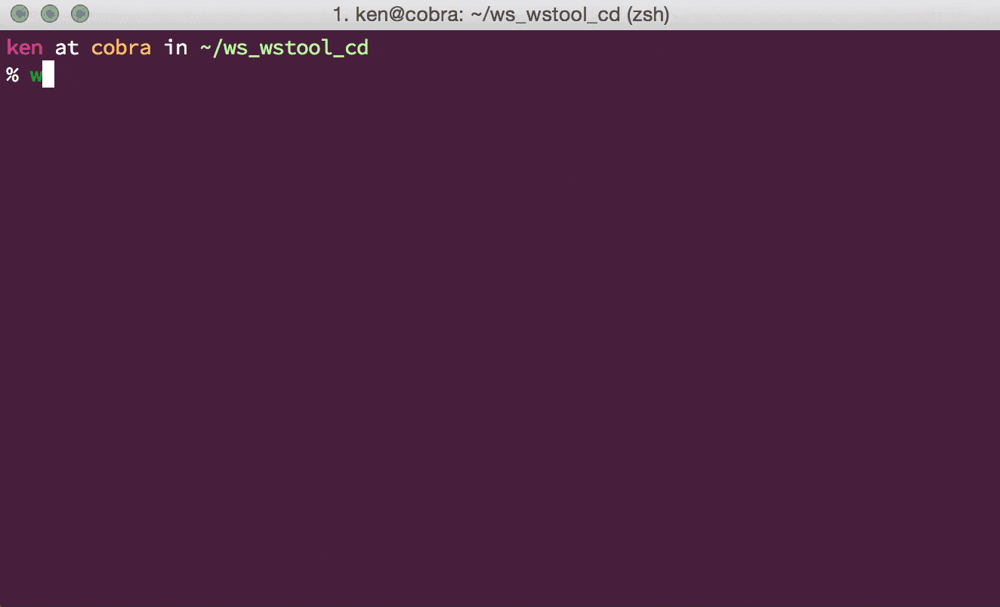

=============
``wstool_cd``
=============

``cd`` to repositories in workspace which is managed by `vcstools/wstool <https://github.com/vcstools/wstool>`_.

Installation
============
install via pypi::

    $ pip install wstool_cd

add following to your `.bashrc` or `.zshrc`::

    source `which wstool_cd.sh`

Usage
=====
maybe this alias is good::

    $ alias wlcd='wstool_cd'

in workspace which is managed by wstool::

    $ wstool_cd  # cd to workspace's root
    $ wstool_cd repo0  # cd to a repo0

you can set ``WSTOOL_DEFAULT_WORKSPACE`` to cd from anywhere::

    $ export WSTOOL_DEFAULT_WORKSPACE=$HOME/ros/indigo/src
    $ pwd  # not in workspace
    /home/wkentaro
    $ wstool_cd ros_comm && pwd # if actually not in workspace, cd to default workspace
    /home/wkentaro/ros/indigo/src/ros_comm

Advanced
========
this is sometimes dangerous, but useful::

    $ source `which wstool_cd_wrapper.sh`
    $ wstool cd repo0  # use cd as sub-command of wstool

this works because::

    wstool () {
      case "$1" in
        (cd) shift
         wstool_cd $@ ;;
        (*) command wstool $@ ;;
      esac
    }

Screencast
==========
This is demo of using wstool_cd:

License
=======
| Copyright (C) 2015 Kentaro Wada
| Released under the MIT license
| http://opensource.org/licenses/mit-license.php
